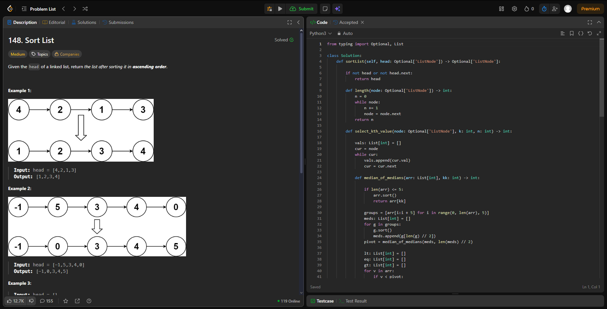
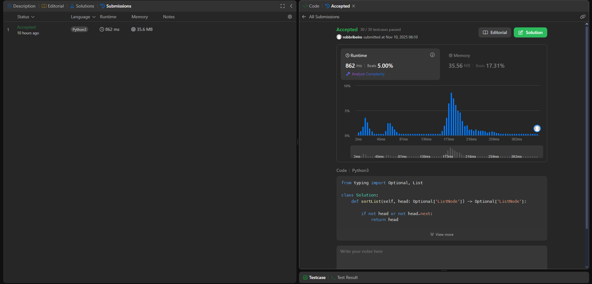
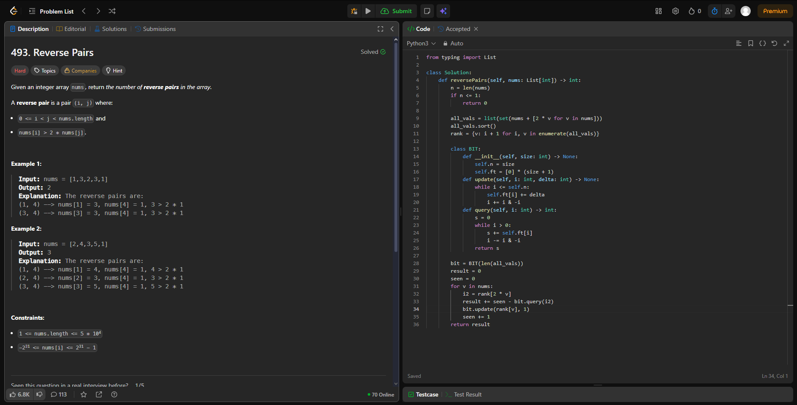
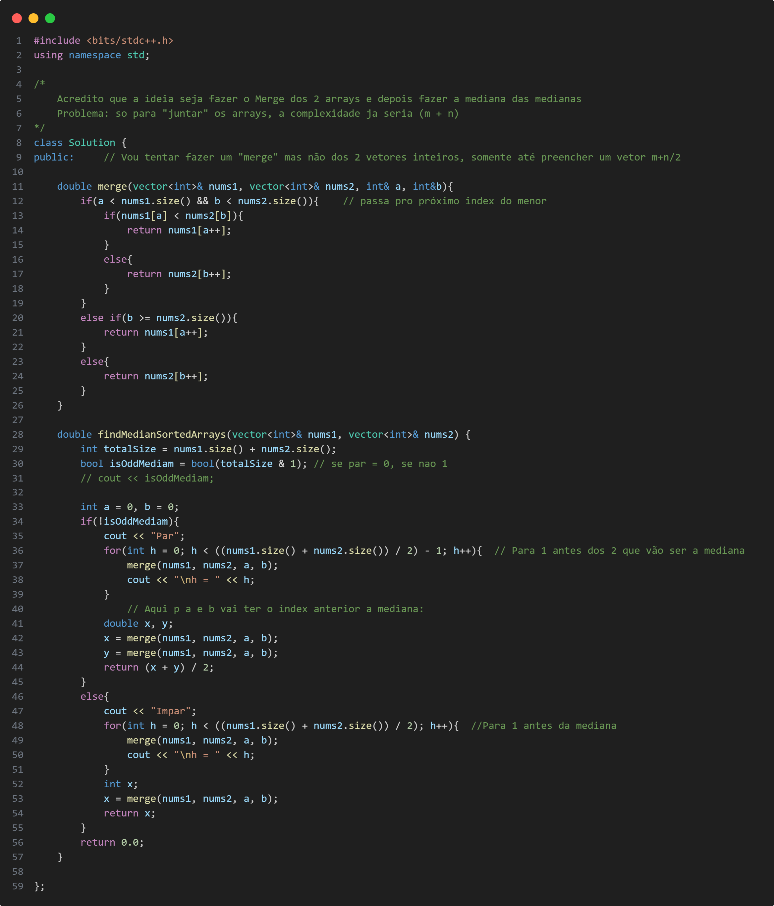
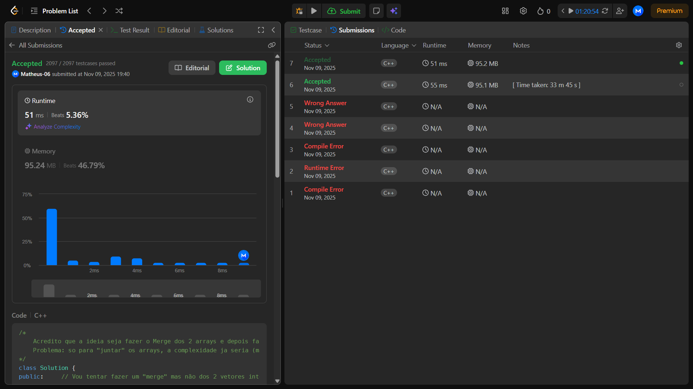
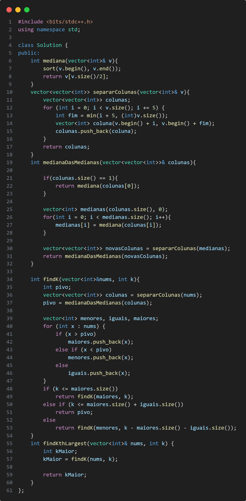
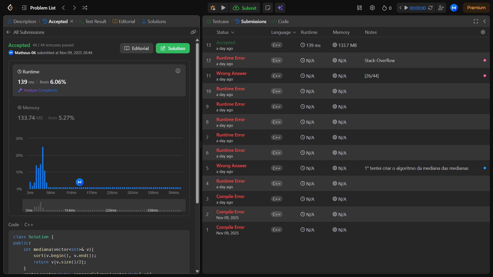
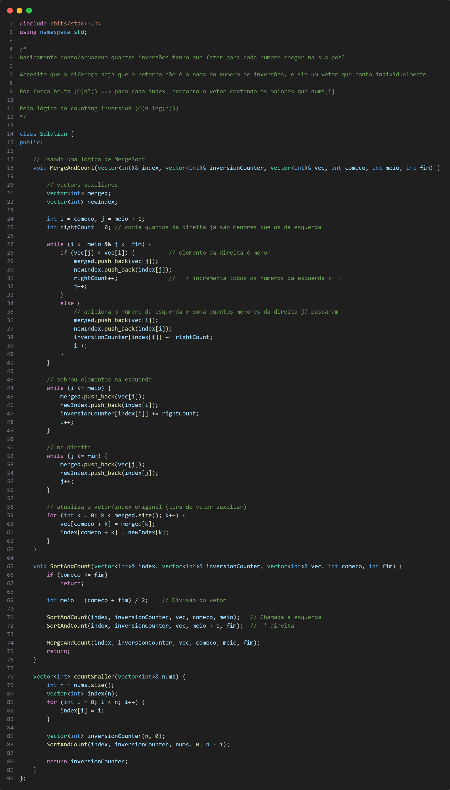
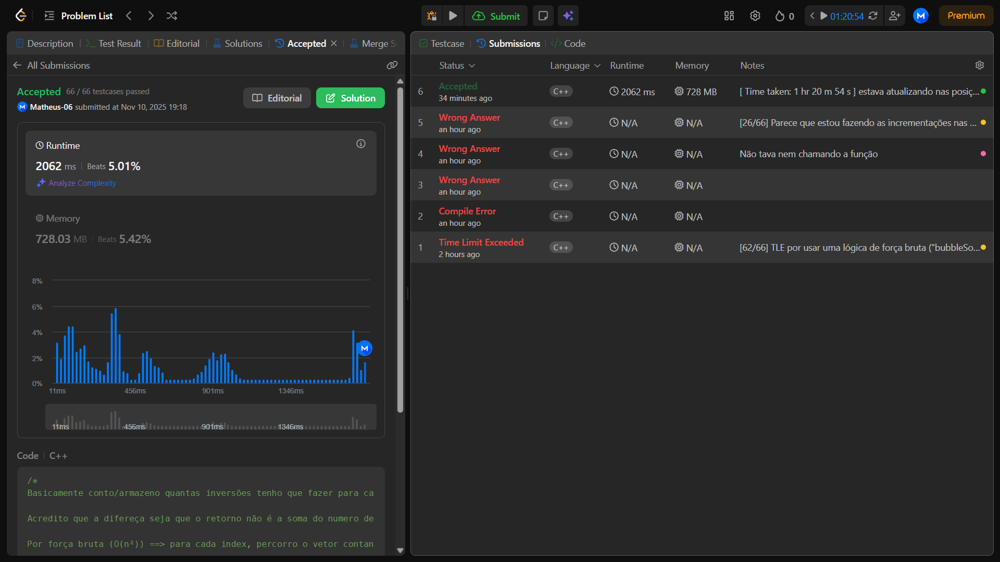

# Dividir-Conquistar_Dupla-60

**Número da Lista**: 60 
**Conteúdo da Disciplina**: FGA0124 - PROJETO DE ALGORITMOS - T01 

## Alunos
|Matrícula | Aluno |
| -- | -- |
| 24/1025336  |  Matheus Pinheiro |
| 22/1022730   |  Robson Junio Ribeiro Macedo |

## Sobre 
Foram escolhidos quatro exercícios da plataforma online e dividido entre a dupla [LeetCode](https://leetcode.com/):
- Três de nível difícil.
- Dois de nível médio.

## Screenshots
-[148. Sort List (Médio)](leetcode.com/problems/sort-list/)

[Código](code/148.py)

-[493. Reverse Pairs (Díficil)](leetcode.com/problems/reverse-pairs/)

[Código](code/493.py)

-[4. Median of Two Sorted Arrays (Díficil)](https://leetcode.com/problems/median-of-two-sorted-arrays/description/)

[Código](code/4.cpp)

-[215. Kth Largest Element in an Array (Médio)](https://leetcode.com/problems/kth-largest-element-in-an-array/description/)

[Código](code/215.cpp)

-[315. Count of Smaller Numbers After Self (Difícil)](https://leetcode.com/problems/count-of-smaller-numbers-after-self/description/)

[Código](code/315.cpp)

## Instalação 
**Linguagem**: Python e C++ 

## Uso 
Explique como usar seu projeto caso haja algum passo a passo após o comando de execução.

## Outros 
Quaisquer outras informações sobre seu projeto podem ser descritas abaixo.

